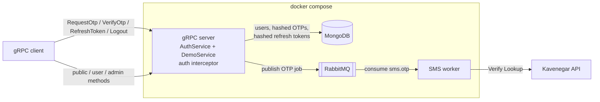

# Gapido Auth Service

Authentication & authorization microservice built for the Gapido backend
code challenge: **Python + gRPC**, **MongoDB**, **RabbitMQ**, **Kavenegar**
OTP delivery, JWT access tokens with rotating refresh tokens, role-based
access control, all packaged with Docker Compose. No web framework is used —
only libraries (`grpcio`, `pymongo`, `pika`, `PyJWT`, `requests`).

## Architecture



Two processes share one codebase:

- **server** (`gapido_auth.server`) — serves the gRPC API. Never talks to
  Kavenegar; it only persists a *hashed* OTP and enqueues a delivery job.
- **worker** (`gapido_auth.worker`) — consumes delivery jobs and calls the
  SMS provider, with retries and a dead-letter queue. Slow or failing SMS
  delivery never blocks or degrades the API.

This split is what makes the service horizontally scalable: both the server
(stateless, all state in MongoDB) and the worker (competing consumers on one
queue) can be scaled with `docker compose up --scale server=N --scale worker=M`.

## Authentication flow

Passwordless phone + OTP:

1. `AuthService.RequestOtp(phone)` — generates a 6-digit code (CSPRNG),
   stores only its peppered HMAC-SHA256, queues the SMS job, returns
   `expires_in` / `retry_after`.
2. `AuthService.VerifyOtp(phone, code)` — verifies the code, creates the
   user on first login (role `admin` if the phone is listed in
   `ADMIN_PHONES`, else `user`), returns a **token pair**:
   - `access_token` — 15-minute HS256 JWT (`sub`, `phone`, `role`, `jti`).
   - `refresh_token` — opaque 256-bit random string, 14-day lifetime.
3. `AuthService.RefreshToken(refresh_token)` — **rotates** the refresh token:
   the presented token is revoked and a new pair is issued.
4. `AuthService.Logout(refresh_token)` — revokes the whole session.

Clients authenticate calls with metadata: `authorization: Bearer <access_token>`.

### Access control

A server interceptor enforces a central method→access policy
(`src/gapido_auth/authz.py`) — **default-deny**: a method without an explicit
policy entry is refused. The three challenge endpoints:

| Method | Access | Failure |
|---|---|---|
| `DemoService.GetPublicNotice` | public | — |
| `DemoService.GetMyProfile` | any authenticated user | `UNAUTHENTICATED` |
| `DemoService.ListUsers` | admin role | `PERMISSION_DENIED` |

## Security design

**OTP**
- Generated with `secrets` (CSPRNG), uniform over the full code space.
- Only `HMAC-SHA256(pepper, phone:code)` is stored — a database dump reveals
  no codes, and a code issued for one phone can never verify for another.
- 2-minute TTL, single-use (atomic consume guards concurrent verification).
- Max 5 verification attempts, counted atomically *before* comparison, so
  parallel guessing cannot exceed the cap — a 6-digit code cannot be
  brute-forced within its lifetime (5 of 1,000,000 combinations).
- Rate-limited per phone: 60 s resend cooldown + 5 requests/hour.
- Every verification failure returns the same opaque error (no oracle for
  whether a code exists, expired, or was wrong).
- Requesting a new code invalidates previous ones (only the latest counts).

**Tokens**
- Access JWTs are short-lived (15 min) and carry the role for stateless authz.
- Refresh tokens are opaque random strings; only SHA-256 hashes are stored.
- Rotation on every refresh. Tokens form a *family* (one login session);
  presenting an already-rotated token is treated as theft and **revokes the
  entire family** (reuse detection). Logout revokes the family too.
- Constant-time comparisons (`hmac.compare_digest`) where secrets are checked.

**Operational**
- Config refuses placeholder/short secrets on boot (`make env` generates real ones).
- Containers run as a non-root user; secrets live in a gitignored `.env`.
- Mongo TTL indexes purge expired OTPs and refresh tokens automatically.

## SMS delivery & error handling

Jobs flow through a plain-AMQP retry topology (no plugins):

```
sms (exchange) -> sms.otp -> worker
   ^                           | transient failure: nack
   |                           v
   +---- sms.otp.retry [15s TTL] <- sms.dlx    (max 4 attempts)
                                       |
                                       +--> sms.otp.dead (parking + reason header)
```

- **Transient** failures (network, Kavenegar 5xx / 402 / 409 / 414 / 418 / 451,
  unknown codes) are retried with a 15 s delay, up to 4 attempts.
- **Permanent** failures (invalid API key 403, bad receptor 411, unapproved
  template 424, …) skip retries and park in `sms.otp.dead` with an
  `x-failure-reason` header for inspection. The full status-code
  classification table lives in `src/gapido_auth/sms/kavenegar.py`.
- Publishes use publisher confirms + persistent messages; queues are durable.

Providers are pluggable via `SMS_PROVIDER`:
- `console` (default) — logs the OTP to the worker log; lets reviewers run
  the whole stack with zero external credentials.
- `kavenegar` — real delivery through the Verify Lookup endpoint
  (`KAVENEGAR_API_KEY` + `KAVENEGAR_TEMPLATE` required).

## Quick start

```bash
make env    # .env from template + freshly generated secrets
make up     # docker compose up --build -d  (mongo, rabbitmq, server, worker)
make logs
```

The API listens on `localhost:50051`. Server reflection is enabled, so you
can drive it with [grpcurl](https://github.com/fullstorydev/grpcurl):

```bash
# 1. request a code (worker log prints it when SMS_PROVIDER=console)
grpcurl -plaintext -d '{"phone": "09123456789"}' \
  localhost:50051 gapido.auth.v1.AuthService/RequestOtp
docker compose logs worker | grep console-sms

# 2. log in
grpcurl -plaintext -d '{"phone": "09123456789", "code": "<code>"}' \
  localhost:50051 gapido.auth.v1.AuthService/VerifyOtp

# 3. call the three demo endpoints
grpcurl -plaintext localhost:50051 gapido.demo.v1.DemoService/GetPublicNotice
grpcurl -plaintext -H "authorization: Bearer <access_token>" \
  localhost:50051 gapido.demo.v1.DemoService/GetMyProfile
grpcurl -plaintext -H "authorization: Bearer <admin_access_token>" \
  localhost:50051 gapido.demo.v1.DemoService/ListUsers

# 4. rotate / revoke
grpcurl -plaintext -d '{"refresh_token": "<refresh>"}' \
  localhost:50051 gapido.auth.v1.AuthService/RefreshToken
grpcurl -plaintext -d '{"refresh_token": "<refresh>"}' \
  localhost:50051 gapido.auth.v1.AuthService/Logout
```

To become admin, log in with a phone listed in `ADMIN_PHONES` in `.env`
(default `09120000000`).

To send real SMS, set in `.env`: `SMS_PROVIDER=kavenegar`,
`KAVENEGAR_API_KEY=...`, `KAVENEGAR_TEMPLATE=...` (a Verify Lookup template
defined in your Kavenegar panel), then `docker compose up -d worker`.

## Testing

```bash
make install            # local venv install with dev extras
make test               # 72 unit tests, no external services needed
```

Unit tests cover the OTP policy (expiry, single-use, attempt caps, rate
limits), token rotation and reuse detection, Kavenegar response
classification, worker retry/DLQ behavior, config validation, and the
role-based interceptor running on a real in-process gRPC server.

The integration suite drives the full journey (OTP → queue → login → RBAC →
refresh rotation → reuse revocation → logout) against the compose stack. It
reads OTP jobs off RabbitMQ itself, so stop the worker first:

```bash
make up && docker compose stop worker
make test-integration   # RABBITMQ_URL=... if you changed the published port
docker compose start worker
```

## Project layout

```
protos/                     gRPC contracts (auth.proto, demo.proto)
src/gapido_auth/
  config.py                 env-driven configuration with validation
  authz.py                  central method -> access-level policy (default-deny)
  server.py, worker.py      the two process entrypoints
  core/                     domain logic: otp.py, tokens.py, errors.py
  db/                       Mongo client, indexes, repositories
  messaging/                RabbitMQ topology + thread-safe publisher
  sms/                      provider abstraction, Kavenegar client, console fallback
  services/                 AuthService / DemoService gRPC servicers
  interceptors/             authentication/authorization interceptor
  proto/                    generated stubs (make proto regenerates)
tests/                      unit suite (fakes) + integration suite (marked)
```

## Configuration reference

All settings come from environment variables — see [.env.example](.env.example)
for the complete annotated list (Mongo/RabbitMQ URLs, JWT and OTP policy
knobs, SMS provider selection, admin phones, ports).
